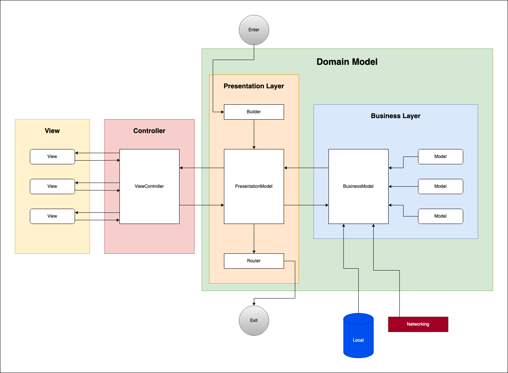

# MVC Template
Yet another template for iOS development

Has two different but related templates. **MVCScene.xctemplate** and **MVCBusinessModel.xctemplate**

You should also use **BaseProtocols** in your project.

## Architecture


## How to install
Run following command.
```sh
make install_templates
```

